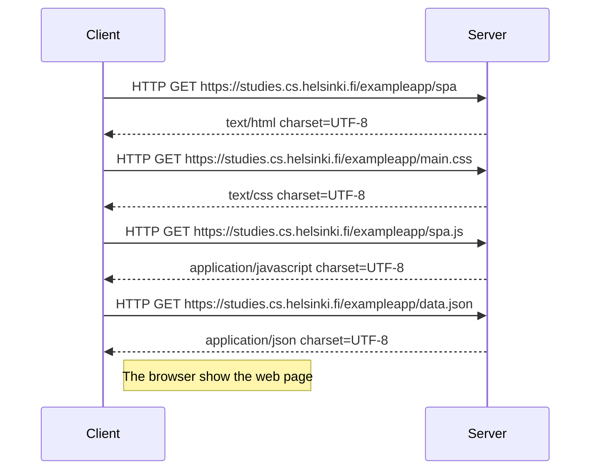

### 0.4: SPA diagram

```mermaid
sequenceDiagram;
    participant Client;
    participant Server;

    Client->>Server: HTTP GET https://studies.cs.helsinki.fi/exampleapp/spa;
    Server-->>Client: text/html charset=UTF-8;

    Client->>Server: HTTP GET https://studies.cs.helsinki.fi/exampleapp/main.css;
    Server-->>Client: text/css charset=UTF-8;

    Client->>Server: HTTP GET https://studies.cs.helsinki.fi/exampleapp/spa.js;
    Server-->>Client: application/javascript charset=UTF-8;

    Client->>Server: HTTP GET https://studies.cs.helsinki.fi/exampleapp/data.json;
    Server-->>Client: application/json charset=UTF-8;

    Note right of Client: The browser show the web page;
```